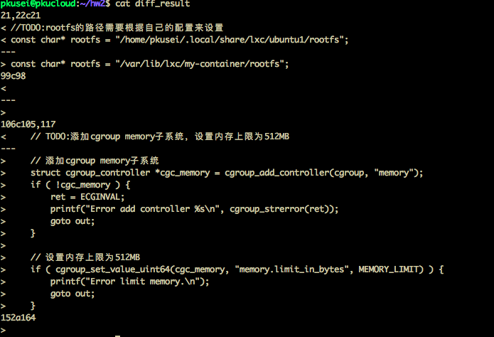
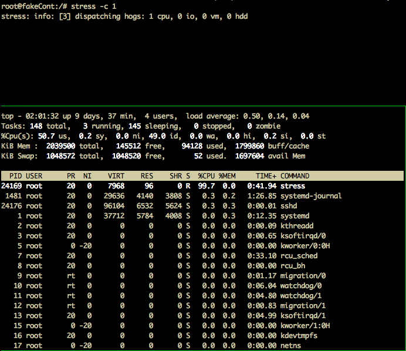
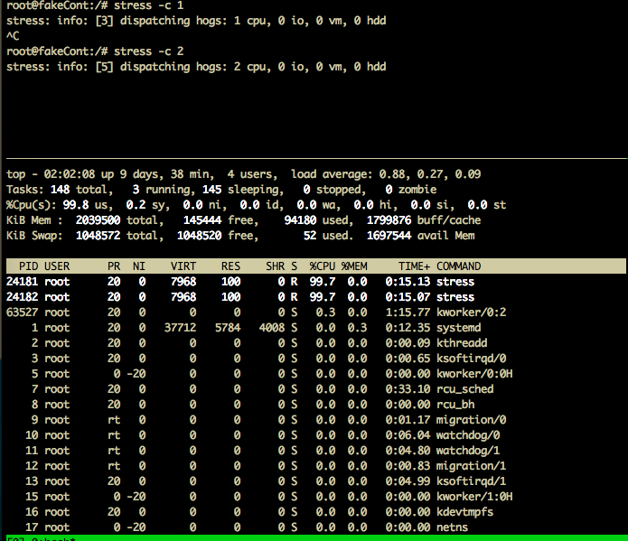
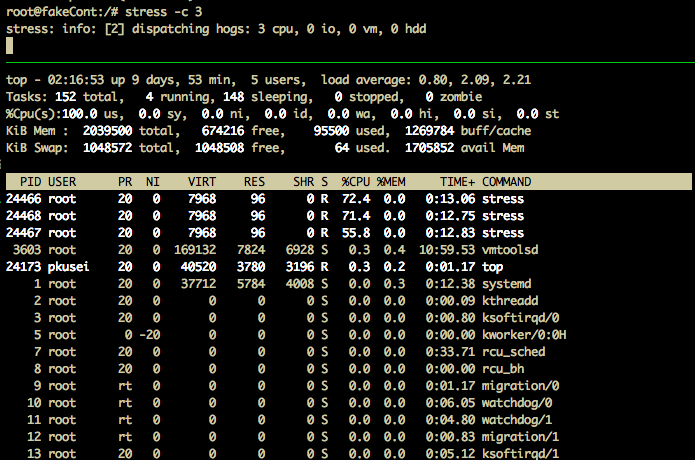
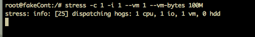
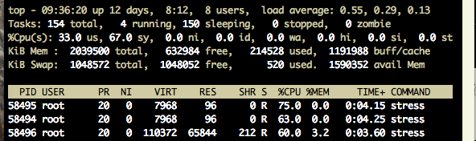
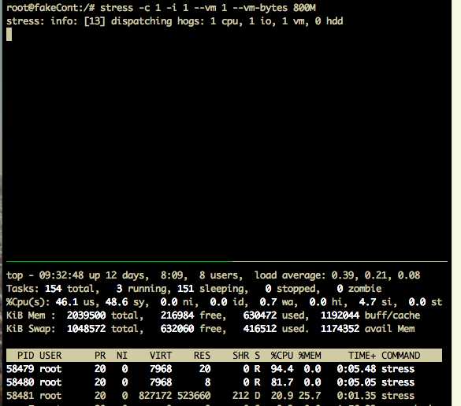
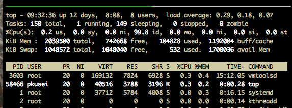
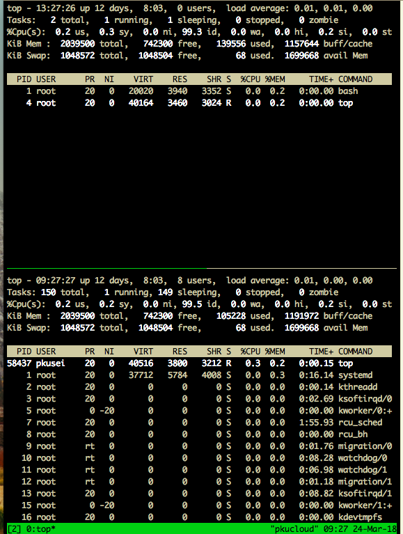

## 第二次作业

任路遥

1500012787

### Part 1

我选取了/usr/share/lxc/templates/lxc-centos进行阅读。

LXC能够虚拟出一个完整的系统环境，即rootfs。rootfs主要由以下这几部分组成：/boot：系统启动相关文件；/dev：设备文件；/etc：配置文件；/lib: 库文件等等。

rootfs制作流程：

/usr/share/lxc/templates/lxc-centos为配置centos的配置脚本文件，从中可以看出rootfs的制作流程。主要由以下几部分（按顺序）组成：

检查或设置一些环境变量。

函数copy_configuration

> 将配置拷贝到rootfs_path，设置MAC地址。
>
> 
>
> copy configuration to rootfs_path
>
> create static MAC addresses for each interface in the container.

函数install_centos

> 安装centos。
>
> 
>
> call download_centos or update_centos
>
> Copy cache/rootfs to rootfs_path

函数download_centos

> 主要任务是下载centos镜像，设置设备号，配置和host一样的nameserver，检查rpmdb（用于初始化和重建rpm数据库）。
>
> 
>
> check the cache for the centos mirror, download the mirror into cache
>
> use temporary repository definition
>
> create minimal device nodes
>
> create symlink for /var/run -> ../run
>
> use same nameservers as hosts
>
> check whether rpmdb is under $HOME
>
> check whether rpmdb version is correct

函数configure_centos:

> 具体来说，有以下一些：在CentOS禁掉selinux；检查/etc/selinux/config；禁pam_loginuid；设置time；检查 /etc/init.d/halt ；配置网络；设置一些host相关参数；建立lxc的初始化脚本；设置命令台及登录。
>
> 
>
> disable selinux in CentOS
>
> kill it in the /etc/selinux/config file if it's there
>
> disabling pam_loginuid in the above config files
>
> Set default localtime to the host localtime 
>
> Deal with some dain bramage in the /etc/init.d/halt script.
>
> configure the network using the dhcp
>
> set the hostname, minimal hosts, minimal fstab
>
> create lxc compatibility init script
>
> setup console and tty[1-4] for login.
>
> allow root login on console, tty[1-4], and pts/0 for libvirt
>
> prevent mingetty from calling vhangup(2)

函数configure_centos_init:

> 修改一些设置，启动网络等。
>
> 
>
> change the setting in /etc/rc.sysinit, /etc/rc.d/rc.sysinit
>
> chroot ${rootfs_path} chkconfig network on
>
> make upstart honor SIGPWR

最后进行了对密码的设定

当然以上过程中还涉及到一些出错机制的处理

如函数revert:

> 脚本程序被中断时(收到SIGHUP SIGINT SIGTERM)使用该函数完成清理工作
>
> 使用lxc-destroy和rm -rf $path

### Part2

完善 [fakeContainer.c](http://sei.pku.edu.cn/~caodg/course/osprac/code/fakeContainer.c)代码:

测试：

使用了stress工具进行测试。

CPU压力测试：

单个进程下cpu运行情况：

两个进程下cpu运行情况：

三个进程下cpu运行情况：

解释：使用tmux分屏工具，上半部分是在fakecontainer中运行，下半部分在外部使用top进行监控。

可以发现cpu的运行情况符合我们的预期。

memory压力测试：

测试的内存没有超过限制(128Mb)，一切运行正常。同时，可以在宿主中看到其运行时占用了不多的内存。

我们在启动LXC-container时对其添加了内存限制512M，当压力测试中产生内存分配函数的进程过多且申请的内存较多，且在多线程下时，容器会停止运行，

但如果使用单线程进行实验，并申请超过限制的内存大小，会发现进程并没有被杀死。

原因可能是宿主在管理时可能将其写入到了交换分区里。我们知道内存由cgroups进行管理的，Linux有一个Swap机制，即当内存不够用的时候，我们可以选择性的将一块磁盘、分区或者一个文件当成交换空间，将内存上一些临时用不到的数据放到交换空间上，以释放内存资源给急用的进程。

我们可以通过在宿主中观察到此时stress占用了约1/4的内存（上图），且对比测试前Swap的内存情况（下图）可以发现used一项的增加(同时free一项的减少)，这一点验证了我们的猜想。

### Part3

**你认为lab 1在代码方面需要从哪些方面进行提高**?

容器的初始进程和宿主中的初始进程有区别。宿主1号进程是systemd，容器中1号进程是bash。宿主运行真实任务，其分配进程号一般是比较大的，而容器中分配到的进程号非常小。

目前，lab1代码建的container还不能支持网络栈。lab1的代码还没能给出比较方便的API来让宿主访问容器，包括对容器内部发送信号，只能通过运行后进入容器再进行操作。同时，没有好的机制使得宿主来暂停、恢复容器，对容器进行方便的管理。LXC还支持snapshot，checkpoint等功能，这是lab1的还缺少的。

lab1的代码对资源的隔离性做的还不够，以及对安全性的隔离，存在使用者从容器中进入宿主，使用宿主中其他资源的可能。可以从上图看到，在容器中使用top命令其看到的内存使用情况是和宿主里一致的。需要对权限、设备进行更精细的控制。对于资源的管理也是重要的，如果需要提高lab1代码，可能还需要对于宿主资源进行合理的分配调整。如出现了out of memory等情况时对异常的处理等等。

参考资料：

http://liwei.life/2016/01/22/cgroup_memory/

[LXC Doc](https://linuxcontainers.org/lxc/articles/)
