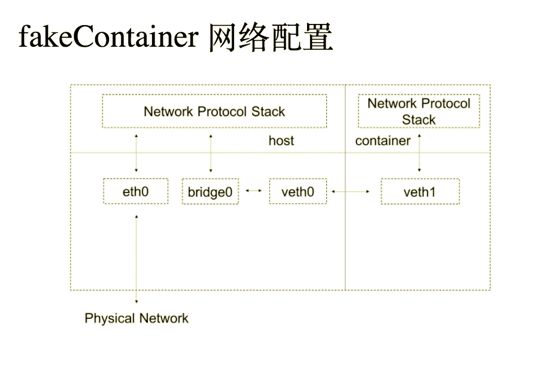

## Hw3

任路遥 1500012787


### Part A

在Linux中，网络包会通过以下几层进行传输

1. Prerouting 链: 在进行路由选择后处理数据包（对数据链进行源地址修改转换）
2. Input 链: 处理入站数据包
3. Output 链: 处理出站数据包
4. Forward 链: 处理转发数据包
5. Postrouting 链: 在进行路由选择前处理数据包（做目标地址转换）


INPUT、OUTPUT链主要用在“主机型防火墙”中，即主要针对服务器本机进行保护的防火墙；而FORWARD、PREROUTING、POSTROUTING链多用在“网络型防火墙”中。


有四种规则表：

​	1. filter 表：默认的也是最常用的table，用来决定是否允许包到达它的目的地。

​	2. mangle 表: 允许用多种方式调整包的头，如调整TTL的值

​	3. nat 表: 允许通过改变包的源地址和目标地址来将包路由到在NAT网络中不同的host上。常被用来连接到不能直接被访问的服务上。

​	4. raw 表: iptables是有状态的防火墙。允许你在内核开始跟踪状态前处理包。而且，你可以在状态跟踪中免除特定的包。


表中包含链的信息如下：


反过来(在下图中可以看出)，

- PREROUTING链包含有*nat*, *mangle* and *raw* 表。
- INPUT链包含有*mangle* and *filter* 表.
- OUTPUT链包含有*raw*, *mangle*, nat and *filter* 表.
- FORWARD链包含有*mangle* and *filter* 表.
- POSTROUTING链包含有*nat* and *mangle* 表。


规则链之间的顺序如下(在上图中可以看出)：

- 入站：PREROUTING —> INPUT
- 出站：OUTPUT —> POSTROUTING
- 转发：PREROUTING —> FORWARD —> POSTROUTING

规则链内的匹配顺序

- 按顺序依次检查，匹配即停止（LOG策略例外）
- 若找不到相匹配的规则，则按该链的默认策略处理


### Part B

1）

拒绝来自某一特定IP地址的访问；

```bash
iptables -t filter -A INPUT -s $ip -j REJECT
```

测试：

将两台电脑同时连到一个局域网中

后图中前后两次ping同一地址


2）

只开放本机的http和ssh服务，其余协议与端口均拒绝；

```bash

# 开放22和80端口
sudo iptables -A INPUT -p tcp --dport 22 -j ACCEPT  
sudo iptables -A OUTPUT -p tcp --sport 22 -j ACCEPT  
sudo iptables -A INPUT -p tcp --dport 80 -m state --state NEW,ESTABLISHED -j ACCEPT  
sudo iptables -A OUTPUT -p tcp --sport 80 -m state --state NEW,ESTABLISHED -j ACCEPT  

# 禁用其他协议与接口
sudo iptables -P INPUT DROP  
sudo iptables -P FORWARD DROP  
sudo iptables -P OUTPUT DROP  

# 允许本地回环接口
sudo iptables -A INPUT -s 127.0.0.1 -d 127.0.0.1 -j ACCEPT  

# 允许已建立的或相关连的通行 
sudo iptables -A INPUT -m state --state ESTABLISHED,RELATED -j ACCEPT  

# 允许所有本机向外的访问 

sudo iptables -A OUTPUT -j ACCEPT  
```


利用服务器162.105.175.144进行测试：

利用nginx开启一个服务后访问（默认为80）


若修改nginx配置文件后改为81端口则无法访问：


若次数删去之前添加的iptables，则可正常访问：


3）拒绝回应来自某一特定IP地址的ping命令

```bash
sudo iptables -I OUTPUT -s $IP -p icmp --icmp-type echo-reply -j DROP
```


测试：

初始能正常在本地ping通服务器，然后在服务器上设置上述语句后无法ping通。


### Part C


>  请解释路由与交换这两个概念的区别，并介绍bridge, veth这两种Linux网络设备的工作原理;


路由：使用IP地址 根据路由表 转发数据包。

   通过具有路由功能设备(例如路由器)实现网络层的功能。


交换：使用 MAC地址 根据MAC地址表 转发数据帧。

   通过具有交换功能设备(例如交换机)实现OSI七层参考模型中数据链路层的功能。


区别：

1、工作层次不同 ：交换机工作在第二层，数据链路层; 路由器工作在第三层，网络层；

2、回路

​     根据交换机地址学习和站表建立算法，交换机之间不允许存在回路。一旦存在回路，必须启动生成树算法，阻塞掉产生回路的端口。而路由器的路由协议没有这个问题，路由器之间可以有多条通路来平衡负载，提高可靠性。

3、子网划分：交换机只能识别MAC地址；路由器识别IP地址

4、负载集中：  交换机之间只能有一条通路，使得信息集中在一条通信链路上，不能进行动态分配，以平衡负载。路由器的路由协议算法可以避免这一点，ＯＳＰＦ路由协议算法不但能产生多条路由，而且能为不同的网络应用选择各自不同的最佳路由。 


veth:

veth设备成对出现，两个设备彼此相连，一个设备收到协议栈的数据发送请求后，会将数据发送到另一个设备上去。


bridge:

bridge是一个虚拟网络设备，可以配置IP、MAC地址等，同时bridge是一个虚拟交换机，和物理交换机功能类似。bridge有多个端口，数据可以从任何端口进来，进来之后从哪个口出去和物理交换机的原理差不多，要看mac地址。


### Part D

> 按照课件描述的结构图在上节课fakeContainer的基础上为其增加网络功能，使fakeContainer内部可以访问Internet;

物理网卡为ens32；外网IP地址为162.105.175.63；外网网关为162.105.175.0

设置bridge ip为192.168.3.101；container ip为192.168.3.102


``` bash
# 以下在host中

# 创建bridge

sudo ip link add name br0 type bridge

sudo ip link set br0 up

# 给bridge配置ip
sudo ip addr add 192.168.3.101/24 dev br0

# 创建veth

sudo ip link add veth0 type veth peer name veth1

# 桥接veth0和br0
sudo ip link set dev veth0 master br0

sudo ip link set veth0 up

sudo ip link set veth1 netns 15115 # 值为container的pid

# 以下在container中

ip link set veth1 up

ip route add default dev veth1

# 为veth1设置ip

ip addr add 192.168.3.102/24 dev veth1
```

测试结果:

host中看bridge情况：


host 中 ping container


container中ping host:


> 使fakeContainer可以通过bridge访问外网

利用在host上通过iptables设置源地址转换


````bash
# 以下在host中
sudo iptables -t nat -D POSTROUTING -s 192.168.3.102/24 -j MASQUERADE

# 以下在container中
route add default gw 192.168.3.101
````


在container中测试：


> container中部署nginx服务器


``` bash
# 以下在container中

# 下载nginx
sudo apt-get install nginx
# 启动nginx
sudo /usr/sbin/nginx

# 以下在host中

# 端口映射 (设置外网端口为6677)
sudo iptables -t nat -A PREROUTING -p tcp --dport 6677 -j DNAT --to-destination 192.168.3.102:80
```


测试结果：


> 解释一个外部用户在从fakeContainer中nginx服务器得到web服务这个过程中，网络包在Linux服务器上经过了什么样的处理流程。


如图所示

SNAT（Source Network Address Translation，源地址转换）通常被叫做源映射。

在任何一个IP数据包中，都会有Source IP Address与Destination IP Address这两个字段，数据包所经过的路由器也是根据这两个字段是判定数据包是由什么地方发过来的，它要将数据包发到什么地方去。而iptables的SNAT就是根据这个原理，对Source IP Address与Destination IP Address进行修改。


图中正菱形的区域是对数据包进行判定转发的地方。在这里，系统会根据IP数据包中的destination ip address中的IP地址对数据包进行分发。如果destination ip adress是本机地址，数据将会被转交给INPUT链。如果不是本机地址，则交给FORWARD链检测。 

SNAT是要在数据包流出这台机器之前的最后一个链也就是POSTROUTING链来进行操作

```bash
iptables -t nat -A POSTROUTING -s 192.168.0.0/24 -j SNAT --to-source $ip
```

这个语句就是告诉系统把即将要流出本机的数据的source ip address修改成为*$ip*。这样，数据包在达到目的机器以后，目的机器会将包返回到*$ip*也就是本机。如果不做这个操作，那么你的数据包在传递的过程中，reply的包肯定会丢失。

MASQUERADE 设定是将IP伪装成为封包出去(-o)的那块装置上的IP。不管现在eth0的出口获得了怎样的动态ip，MASQUERADE会自动读取eth0现在的ip地址然后做SNAT出去，这样就实现了很好的动态SNAT地址转换。

最后的效果如下图所示


网络包进入到服务器中时，按照下图的配置方式，依次从bridge0到veth0再到veth1，到达container。



### 参考资料

[An In-Depth Guide to iptables, the Linux Firewall](https://www.booleanworld.com/depth-guide-iptables-linux-firewall/)

[Iptables—包过滤（网络层）防火墙](https://www.linuxidc.com/Linux/2013-08/88423.htm)

[iptables 添加，删除，查看，修改](http://blog.51yip.com/linux/1404.html)

[Docker为容器分配指定物理网段的静态IP](https://blog.csdn.net/samxx8/article/details/46776073)

[linux-iptables nat设置路由转换](https://blog.csdn.net/cooling88/article/details/51040054)

[Linux虚拟网络设备之bridge(桥)](https://segmentfault.com/a/1190000009491002)

[Linux虚拟网络设备之veth](https://segmentfault.com/a/1190000009251098)

[【 Linux 网络虚拟化 】Netns](https://www.cnblogs.com/hukey/p/6569132.html)

