## Hw4

任路遥 1500012787


### Part A


叙述以下三种情况下容器通信的网络处理过程:

>1）同一host上同一子网内的两容器


不通过网关。两容器直接可以在宿主机的网桥上进行通信。


> 2）同一host上不同子网内的两容器；


如果在不同子网内，则两个容器之间的通信，则必须通过网关。

如果A发现数据包的目的主机不在本地网络中，就把数据包转发给它自己的网关，再由网关转发给B的网关，B的网关再转发给B的某个主机。


> 3）通过gre隧道相连的两个host上同一子网内的两容器；


先通过gre隧道到达网关，再由同一网关转发到对应的容器中。

其中，通过gre隧道有一个加和解封装的过程。

**加封装过程**

1. Router A连接Group 1的接口收到X协议报文后，首先交由X协议处理；
2. X协议检查报文头中的目的地址域来确定如何路由此包；
3. 若报文的目的地址要经过Tunnel才能到达，则设备将此报文发给相应的Tunnel接口；
4. Tunnel口收到此报文后进行GRE封装，在封装IP报文头后，设备根据此IP包的目的地址及路由表对报文进行转发，从相应的网络接口发送出去。

**解封装的过程**

解封装过程和加封装的过程相反。

1.  Router B从Tunnel接口收到IP报文，检查目的地址；
2. 如果发现目的地是本路由器，则Router B剥掉此报文的IP报头，交给GRE协议处理（进行检验密钥、检查校验和及报文的序列号等）；
3. GRE协议完成相应的处理后，剥掉GRE报头，再交由X协议对此数据报进行后续的转发处理。


### Part B


> 了解并叙述vlan技术的原理，解释vlan在用户隔离数量上的限制；

VLAN（Virtual Local Area Network）又称虚拟局域网，是指在交换局域网的基础上，采用网络管理软件构建的可跨越不同网段、不同网络的端到端的逻辑网络。

VLAN工作在OSI 参考模型的第2层和第3层，VLAN之间的通信是通过第3层的路由器来完成的。

VLAN通过限制广播帧转发的范围分割了广播域，理解为将一台交换机在逻辑上分割成了数台交换机。

VLAN间的通信也需要路由器提供中继服务，这被称作“VLAN间路由”。

VLAN的技术实现中最常见的采用帧标签的方式，IEEE 802.1Q提供了帧标签的标准，在VLAN Tag标签中，包含有VLAN ID是一个12位的域，可以支持4096个VLAN实例，而User Priority则是一个3位的帧优先级，共有8种优先级。网络中以太数据帧能够通过VLAN ID和User Priority来区别不同的网络流量。

为了在二层网络上隔离用户或者隔离广播，可以将一组设备加入到一个VLAN中，但是VLAN的最大个数只有4094，这就限制了组网规模，所以当需要隔离大量的域时将可能受到VLAN个数的限制。


### Part C


> 调研[vxlan](https://msandbu.wordpress.com/2015/12/03/software-defined-networking-difference-between-vxlan-and-nvgre/)技术，比较其与gre技术的差异；


传统的VLAN包如下：

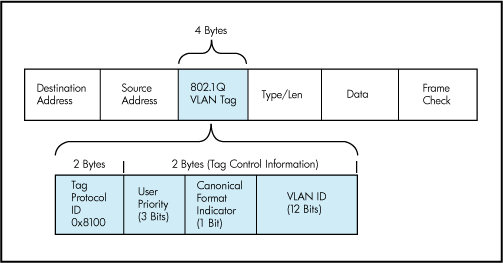


VXLAN和GRE都对VLAN包进行了改进使得其很好的支持软件定义网络。


VXLAN和GRE都是用三层协议封装二层协议，但是是两种不同的协议；两项技术都解决了VLAN规模固定的问题（可以不止4094个）。


VXLAN主要是由Cisco公司推出。网络被分成不同的段，并且只有拥有相同VXLAN段的虚拟机等可以互相通信 。VXLAN的包头有一个24bit的ID段，即意味着1600万个独一无二的虚拟网段，这个ID通常是对UDP端口采取伪随机算法而生成的。这样做的好处是可以保证基于5元组的负载均衡，保存VM之间数据包的顺序。

由于数据包比较大，所以VXLAN需要借助支持大型帧的传输网络才能支持数据包规模的扩展。

VXLAN封装将数据包大小扩展到50字节，如下图所示：

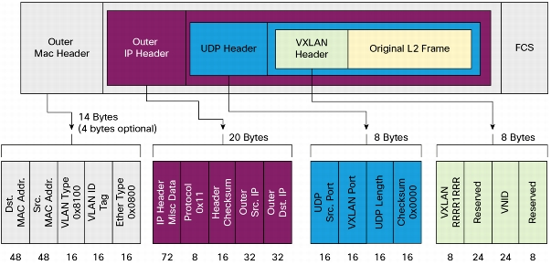


GRE主要由Microsoft支持。使用GRE头部的低24位作为租户网络标识符（TNI），与VXLAN一样可以支持1600个虚拟网络。NVGRE不需要依赖泛洪和IP组播进行学习，而是以一种更灵活的方式进行广播，但是这需要依赖硬件/供应商。NVGRE支持减小数据包最大传输单元以减小内部虚拟网络数据包大小，不需要要求传输网络支持传输大型帧。

为了提供描述带宽利用率粒度的流，传输网络需要使用GRE头，但是这导致NVGRE不能兼容传统负载均衡，这是NVGRE与VXLAN相比最大的区别也是最大的不足。

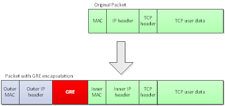


OVS同时支持这两种隧道协议。


### Part D


> 1）按照课件上的网络结构，基于ovs，通过vlan和gre技术构建两个隔离的lxc容器集群，报告中请体现出集群内部的连通性和不连通集群间的隔离性；


使用的机器：

162.105.175.144

162.105.175.75


安装ovs

```bash
sudo apt install openvswitch-switch
```


如图所示如下建立网络架构

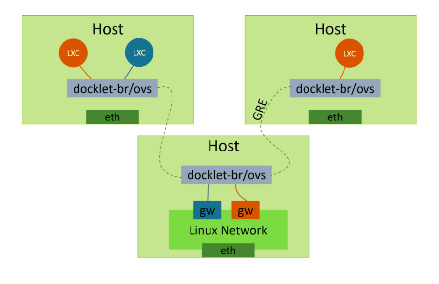


其中蓝色在本实验中为internal port in1: 172.16.1.1/24

其中橙色在本实验中为internal port in2: 172.16.2.1/24

注意对in1 和 in2 设置不同的tag 来进行隔离

对于两台host，使用名为test-gre的GRE通道将各自的bridge(名为test-br)进行连接。


```bash
# 在 162.105.175.144 机器的 host 上

sudo ovs-vsctl add-br test-br

sudo ip link set test-br up


sudo ovs-vsctl add-port test-br test-gre -- set interface test-gre type=gre option:remote_ip=162.105.175.75


sudo ovs-vsctl add-port test-br in1 -- set interface in1 type=internal

sudo ip addr add 172.16.1.1/24 dev in1

sudo ip link set in1 up

sudo ovs-vsctl set port in1 tag=101 


sudo ovs-vsctl add-port test-br in2 -- set interface in2 type=internal

sudo ip addr add 172.16.2.1/24 dev in2

sudo ip link set in2 up

sudo ovs-vsctl set port in2 tag=102


sudo iptables -t nat -A POSTROUTING -s 172.16.1.0/24 -j MASQUERADE

sudo iptables -t nat -A POSTROUTING -s 172.16.2.0/24 -j MASQUERADE

```


``` bash
# 在 162.105.175.75 机器的 host 上

sudo ovs-vsctl add-br test-br

sudo ip link set test-br up

sudo ovs-vsctl add-port test-br test-gre -- set interface test-gre type=gre option:remote_ip=162.105.175.144

```


操作后可以使用

``` bash
sudo ovs-vsctl show
```

进行查看（在 162.105.175.144 机器上）：

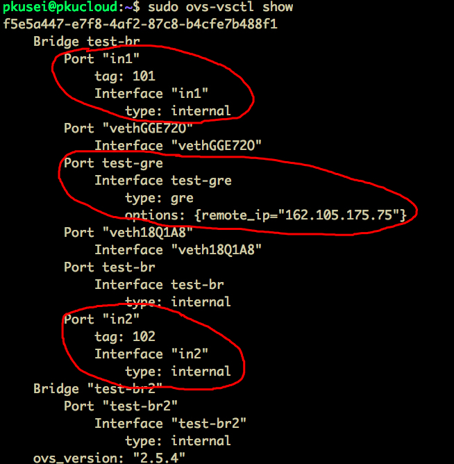


LXC相关操作回顾

```bash
sudo apt install lxc # 安装lxc

sudo lxc-create -t download -n $con # 新建LXC 选择的是ubuntu trusty amd64
 
sudo lxc-destroy -n $con

sudo lxc-stop -n $con

sudo lxc-start -n $con -d

sudo lxc-attach -n $con
```


可以通过编辑LXC的config文件来设置LXC中的IP地址和网关

```bash
sudo vim /var/lib/lxc/$con/config
```


具体设置如下：


host 162.105.175.144 

LXC conatiner:

test1 LXC 本地ip: 172.16.1.9 网关:172.16.1.1 (in1)

test2 LXC 本地ip: 172.16.2.10 网关:172.16.2.1 (in2)


host 162.105.175.75

LXC conatiner:

test4  本地ip: 172.16.1.20 网关: 172.16.1.1 (in1)


利用ping和tcpdump来进行测试：

test4 ping test1 （同一网关） 和  test4 ping test2 （不同网关）


在 162.105.175.144 机器上：

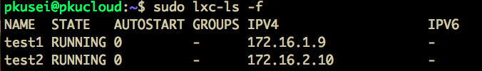


在 162.105.175.75 机器的test4 conainter中：

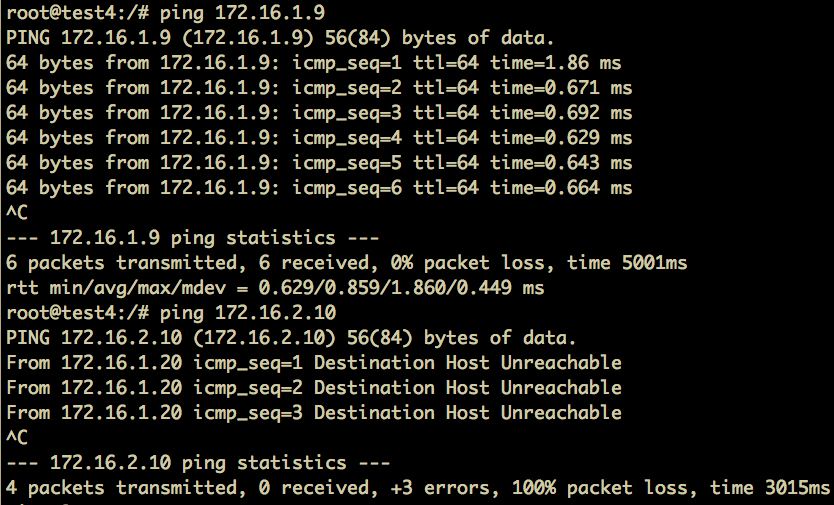


可以再同时打开test1利用tcpdump验证：

test4:

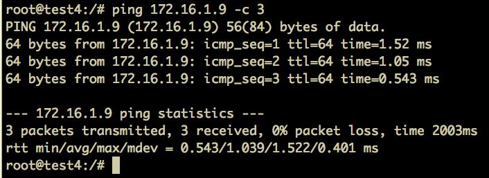

test1:

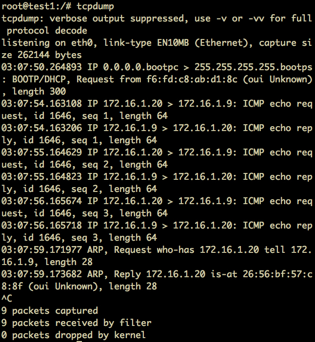


实验结果符合预期。


> 2）不通容器集群同时工作时会竞争系统的网络资源，使用ovs对容器集群的网络进行流量控制，对每个容器集群出口上行下行流量进行限速并测评。


利用OVS中的Quality of Service (QoS)进行流量控制。


使用netperf进行测试。


这里通过host 162.105.175.144 上的 test1 连接 host 162.105.175.75（另一端开启netserver）来测试。


未限速前：

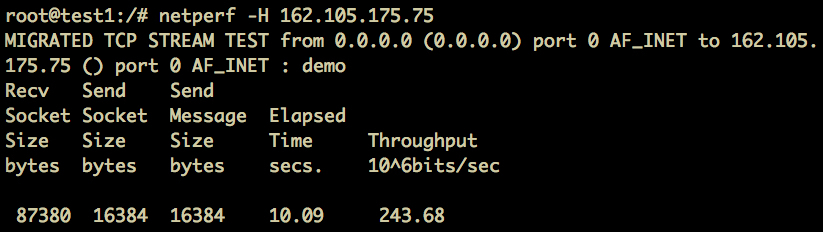


添加如下规则对网关in1进行限速

```bash
sudo ovs-vsctl set interface in1 ingress_policing_burst=100
sudo ovs-vsctl set interface in1 ingress_policing_rate=1000 # 带宽限制为 1M
```


再次进行测试：

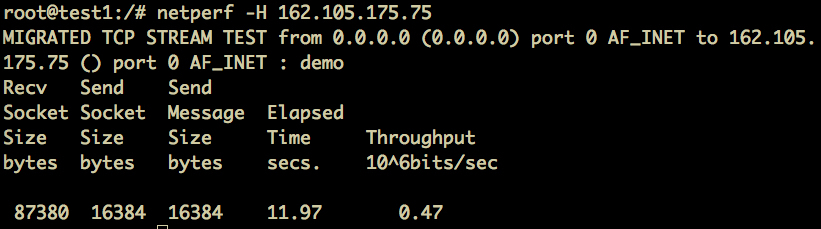


增大为5M:

```bash
sudo ovs-vsctl set interface in1 ingress_policing_burst=500
sudo ovs-vsctl set interface in1 ingress_policing_rate=5000 # 带宽限制为 5M
```


再次进行测试：

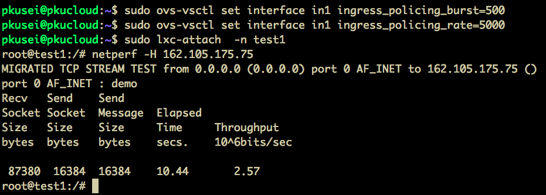


实验结果符合预期。


### 参考资料

[隧道和网络虚拟化:NVGRE vs VXLAN](https://www.sdnlab.com/11819.html)

[openvswitch的原理和常用命令](http://www.cnblogs.com/wanstack/p/7606416.html)

[【Network】OVS VXLAN/GRE 实践](https://www.bbsmax.com/A/obzb3QVJED/)


