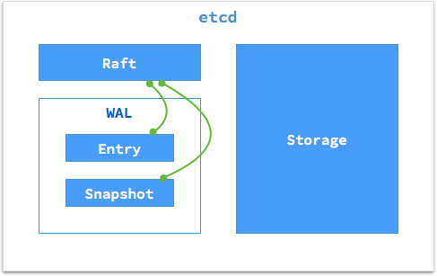
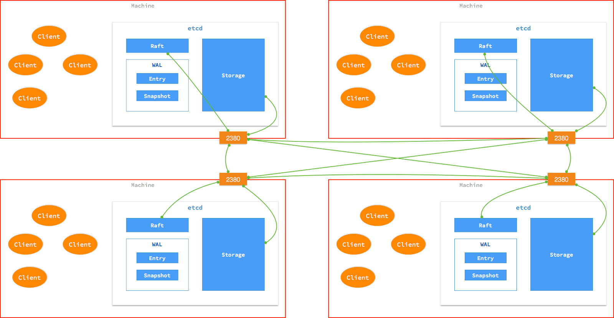

## Hw5

任路遥 1500012787


### Part A

> - 模拟Raft协议工作的一个场景并叙述处理过程;


etcd是一种用于配置共享和服务发现的K-V存储仓库，基于Raft算法充分实现了分布式，能高效地解决分布式系统中各个节点日志内容一致性问题，且集群具备一定的容错能力。

集群中的每个节点都可以根据运行的情况在三种状态间切换：跟随者(follower), 候选人(candidate) 与 领导人(leader)。leader 向 follower 同步日志，follower 只从 leader 处获取日志。leader通过选举的机制产生，简单来说follower节点在将状态切换为 candidate 之后，向集群中其它 follower 节点发送请求，询问其是否选举自己成为 leader，当收到来自集群中过半数节点的接受投票后，节点即成为 leader。


节点可能产生异常，具体有如下几种类型：

leader 不可用：

​	当 leader 不可用时，此时某一 follower 发生 election timeout ，其状态变更为 candidate，并向其他 follower 发起投票。当超过半数的 follower 接受投票后，这一节点将成为新的 leader。当一段时间之后，如果之前的 leader 再次加入集群，则两个 leader 比较彼此的状态，状态旧的 leader 将切换自己的状态为 follower。较早前 leader 中不一致的日志将被清除，并与现有 leader 中的日志保持一致。

​	这里，不一致的日志条目在集群重新完整连通之后会重新保持一致，这也是Raft的容错机制。


follower 不可用 / 新节点加入集群：

​	因为集群中的日志内容始终是从 leader 节点同步的，只要这一节点再次加入集群时重新从 leader 节点处复制日志即可。


多个 candidate 或多个 leader：

​	这通常由于数据传输不畅造成的。两个节点同时成为 candidate 发起选举，并未能选出 leader。此时candidate 将随机选择一个等待间隔（150ms ~ 300ms）再次发起投票，重复选举的过程。


具体更加细节的选举流程与日志复制等流程可以参考[更多材料](https://www.cnblogs.com/cchust/p/5634782.html)。


一个 etcd 节点的核心由三部分组成：

- Raft：raft 状态机是对 raft 共识算法的实现
- WAL：raft 日志存储
- Storage：数据的存储与索引

如图所示



其中WAL，全名为Write-ahead logging，用于向系统提供原子性和持久性的一系列技术。在使用时，所有的修改在提交之前都要先写入 log 文件中。 Entry 负责存储具体日志的内容，而 Snapshot 负责在日志内容发生变化的时候保存 raft 的状态。

etcd 通过主机的特定端口在各个节点中同步 raft 状态及数据。每个主机上的应用程序都可以通过主机的端口以 HTTP + JSON 的方式向 etcd 读写数据。写入的数据会由 etcd 同步到集群的其它节点中。




### Part B

> - 调研GlusterFS和AUFS这两种文件系统，说明其工作原理和特点以及使用方式;


#### GlusterFS

GlusterFS是一个高层次的分布式文件系统解决方案。通过增加一个逻辑层，对上层使用者掩盖了下面的实现，使用者不用了解也不需知道，文件的存储形式、分布。

GlusterFS主要由存储服务器（BrickServer）、客户端以及NFS/Samba 存储网关组成。

GlusterFS借助TCP/IP或InfiniBandRDMA网络将物理分布的存储资源聚集在一起，使用单一全局命名空间来管理数据。客户端可通过原生Glusterfs 协议访问数据，其他没有运行GlusterFS客户端的终端可通过NFS/CIFS 标准协议通过存储网关访问数据。


GlusterFS利用双重特性来提供几TB至数PB的高扩展存储解决方案。Scale-Out架构允许通过简单地增加资源来提高存储容量和性能，磁盘、计算和I/O资源都可以独立增加，支持10GbE和InfiniBand等高速网络互联。Gluster弹性哈希（ElasticHash）解除了GlusterFS对元数据服务器的需求，消除了单点故障和性能瓶颈，真正实现了并行化数据访问。GlusterFS可以对文件进行自动复制，如镜像或多次复制，从而确保数据总是可以访问，甚至是在硬件故障的情况下也能正常访问。

Glusterfs client端有三种：Native client,NFS,Samba。

Native mount client：Gluster Native Client 是基于运行在用户空间的FUSE-based 客户端。 Gluster Native Client 是官方推荐的，是高并发读，高写入性能访问卷最佳模式 。server 端无需做额外设置，只需正常安装，配置glusterfs服务即可。

NFS: Gluster提供了内置的NFS服务，支持其他实现了NFSv3的客户端直接访问。

Samba: CIFS可以提供给WIN及samba客户端访问。挂载使用的是 CIFS 协议。


#### AUFS

AUFS，起初名为Another Union File System，是一种UnionFS，V2版本后更名为 advanced multi‐layered unification fileystem，即高级多层统一文件系统。

AUFS可将多个目录合并成一个虚拟文件系统，成员目录称为虚拟文件系统的一个分支（branch），它可以为每个需要合并的目录指定相应的权限，实时的添加、删除、修改已经被mount好的目录。而且，还能在多个可写的branch/dir间进行负载均衡。


例如，把 /tmp， /var， /opt三个目录联合挂着到 /aufs目录下，则 /aufs目录可见 /tmp， /var， /opt目录下的所有文件。而每个成员目录，则称为虚拟文件系统的一个branch。


每个branch可以指定 readwrite/whiteout‐able/readonly权限，只读（ro），读写（rw），写隐藏（wo）。一般情况下，aufs只有最上层的branch具有读写权限，其余branch均为只读权限。只读branch只能逻辑上修改。如果有重复的文件名，在mount命令行上，越往前的就优先级越高。


AUFS是Docker使用的第一个存储驱动，长时间以来，一直很稳定。虽然目前Docker支持多种存储驱动，而在Ubuntu中默认使用aufs存储驱动，可以使用Docker info指令进行查看。对于Docker而言，AUFS有很多优秀的特点，比如快速启动容器，高效存储利用率，高效内存利用率等。


### Part C

> 安装配置GlusterFS，要求启动容错机制，即一台存储节点挂掉仍然能正常工作。将配置好的分布式文件系统挂在到LXC容器里，在报告里阐述搭建过程和结果;


``` bash
sudo apt-get install glusterfs-server -y

sudo service glusterfs-server start

sudo gluster peer status # 查看gluster信息

sudo gluster peer probe  162.105.175.75

sudo mkdir -p /opt/test

# 启动复制卷
sudo gluster volume create gv replica 2 162.105.175.144:/opt/test 162.105.175.75:/opt/test force

sudo gluster volume info # 查看volume信息

sudo gluster volume start gv # 启动存储卷
```


由于使用的是复制卷，即使其中一台host挂掉了，glusterfs依旧能正常工作，且具有自动修复功能。


可在任意一台host上测试glusterfs 

``` bash
sudo apt-get install glusterfs-client -y # 安装客户端

sudo mkdir -p /tmp/ok

sudo mount.glusterfs 162.105.175.144:gv /tmp/ok
```

右图为162.105.175.144中/opt/test目录，左图为任一客户端/tmp/ok目录，建立连接后写入文件可以看到对应的文件中也写入了同样的文件，再检查162.105.175.75中/opt/test目录，发现文件同样存在。满足预期要求。


下面将存储卷挂载到LXC容器中，利用LXC容器的config文件。


新建container:

```bash
# 以c1为例

sudo lxc-create -t download -n c1 # 随后输入ubuntu trusty amd64

sudo lxc-start -n c1

sudo lxc-attach -n c1
```


修改LXC的config文件，加入如下代码进行挂载(挂载到home/test目录)：

```bash
lxc.mount.entry = /opt/test home/test none bind,rw,create=dir 0 0
```


进入test1后可以看到结果符合我们的预期。


### Part D


> - 使用联合文件系统来为LXC提供镜像服务。具体要求为:创建几个LXC容器，通过AUFS使不同LXC容器尽量共享相同的基础镜像来节约空间。在报告中详细阐述过程。


#### 实验1：数据共享

首先，我们新建两个LXC container分别取名为s1和s2，作为基础镜像。

在s1的home目录中建立base_data文件夹，表示需要共享的数据目录。


在s2的home目录中建立another_base_data文件夹，表示需要共享的数据目录。


现在创建一个新的镜像s3，并新建home/data，然后将上述两个目录union mount到s3的home/data目录中。

``` bash
sudo mount -t aufs -o dirs=/var/lib/lxc/s1/rootfs/home/base_data:/var/lib/lxc/s2/rootfs/home/another_base_data none /var/lib/lxc/s3/rootfs/home/data
```

可以看到s3的home/data目录中包含了s1和s2中的数据。


符合我们的预期。


#### 实验2：对rootfs共享

如果要对于rootfs中的文件进行共享，如我们要基于s1来新建一个s4。则可以直接将如s1的rootfs mount到s4的对应的rootfs目录（且设为只读），这样在启动后，s4会基于s1的rootfs，且在s3中另外的修改不会影响到s1中的rootfs。

代码如下：

``` bash
sudo mkdir /var/lib/lxc/s4

sudo mount -t aufs -o dirs=/var/lib/lxc/s1=ro none /var/lib/lxc/s4 # 这里使用只读模式
```

将如下文件写入 s4.conf 表示s4的config

``` 
# Distribution configuration
lxc.include = /usr/share/lxc/config/ubuntu.common.conf
lxc.arch = x86_64

# Container specific configuration
lxc.rootfs = /var/lib/lxc/s4/rootfs
lxc.rootfs.backend = dir
lxc.utsname = s4
```

然后启动s4

``` bash
sudo lxc-start -n s4 -f s4.conf # 使用上述写入的s4.conf

sudo lxc-attach -n s4
```

进行测试：


发现可以正常工作（root@s1并没有变化，但实际上运行的s4）。由于我们之前设置了只读，我们发现不能在s4中写入文件。我们可以通过设置不同的权限来满足不同的需求。


### 参考资料

[CoreOS 实战：剖析 etcd](http://www.infoq.com/cn/articles/coreos-analyse-etcd)

[Gluster Docs](http://gluster.readthedocs.io/en/latest/)

[GlusterFS架构介绍及运维说明](http://blog.51cto.com/dangzhiqiang/1907174)

[GlusterFs卷的简单操作](https://www.cnblogs.com/zhangb8042/p/7801205.html)

[利用 Aufs 和 LXC 快速建立一个用于测试的系统副本](https://blog.lilydjwg.me/2014/2/19/duplicate-your-system-with-aufs-and-lxc.42928.html)

