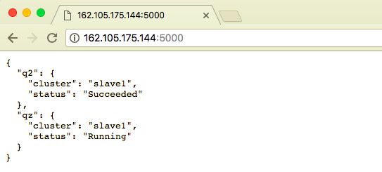

# hw6

任路遥 1500012787


master的对外web server的API接口使用flask实现。具体的API接口见Usage。

对于master和slave之间的通信使用了RPC方法。


### How to Run

```bash
# in slave dir: /slave
sudo python3 run.py
```

```bash
# in master dir: /master
sudo python3 manage.py runserver --host 0.0.0.0 
```


### Usage

/



/job/task

``` json
{ 
    "name" : "task1",  # 任务名称           

    "commandLine": "sleep 10 && echo 10", # 命令行参数

    "outputPath": "data/output.txt", # 输出路径，默认为data/output.txt

    "logPath": "data/log.txt", # 日志路径，默认为data/log.txt

    "maxRetryCount": "2", # 重试次数，默认为0
    
    "resource": {
        "cpu": "0,1",
        "memeory": "512M",
    },
    
    "timeout": "21600", # 超时时限(秒），默认为60s

    "image": "my-ubuntu", # 镜像名称，默认为新建一个空的LXC镜像
                          # 注意这里若有参数，则需要保证镜像在本地存在
}

```


/job/status

``` json
{
    "name" : "task1" # 任务名称   
}
```

/job/kill

``` json
{
    "name" : "task1" # 任务名称   
}
```


### Test

``` bash
# in slave dir: /slave
sudo python3 run.py
```

```bash
# in master dir: /master
sudo python3 manage.py test
```

